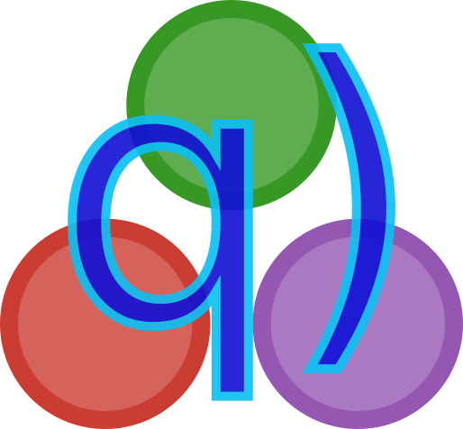

<a name="logo"/>
<div align="center">
<a href="https://enlnt.github.io/Q.jl/latest">
</img>
</a>
</div>

# Q.jl - Julia for kdb+
[](https://travis-ci.org/enlnt/Q.jl)
[](https://codecov.io/gh/enlnt/Q.jl)
[](https://coveralls.io/github/enlnt/Q.jl?branch=master)
[](https://enlnt.github.io/Q.jl/latest)

## Server side

```
q)J)println(42)
42
```

## Client side

With kdb+ running on a local port 8888:

```
julia> using Q
julia> hget(("localhost", 8888), "([]s:`a`b`c;a:11 22 33)")
3×2 Q.K_Table
│ Row │ s │ a  │
├─────┼───┼────┤
│ 1   │ a │ 11 │
│ 2   │ b │ 22 │
│ 3   │ c │ 33 │

julia> ans isa DataFrames.AbstractDataFrame
true
```
